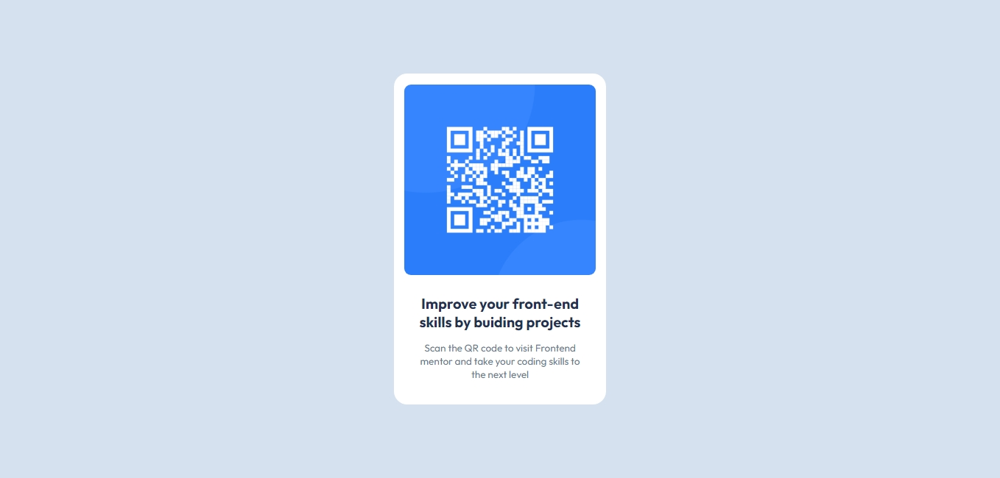

# Frontend Mentor - QR code component solution

This is a solution to the [QR code component challenge on Frontend Mentor](https://www.frontendmentor.io/challenges/qr-code-component-iux_sIO_H). Frontend Mentor challenges help you improve your coding skills by building realistic projects. 

## Table of contents

- [Overview](#overview)
  - [Screenshot](#screenshot)
  - [Links](#links)
- [My process](#my-process)
  - [Built with](#built-with)
  - [What I learned](#what-i-learned)
  - [Continued development](#continued-development)
- [Author](#author)
- [Acknowledgments](#acknowledgments)

## Overview

### Screenshot

### Links

- Solution URL:https://boh-dzomo.github.io/QrCode.github.io/index.html
- live url: https://qr-code-component-iota-mauve.vercel.app/index.html

## My process

### Built with

- Semantic HTML5 markup
- CSS custom properties
- Flexbox

### What I learned

I learned how to use/import Google font

### Continued development
i will like to master css grid,flexbox and semantic HTML

## Author

- Frontend Mentor - [@BOH-DZOMO](https://www.frontendmentor.io/profile/BOH-DZOMO)
- GitHub - [BOH-DZOMO](https://github.com/BOH-DZOMO)

## Acknowledgments
I wish to thank the Frontend mentor team for these challenge
I have always been looking for a place where I can develop my frontend skills.
i also wish to Thank Marie Jossete for introducing me to frontend Mentor

